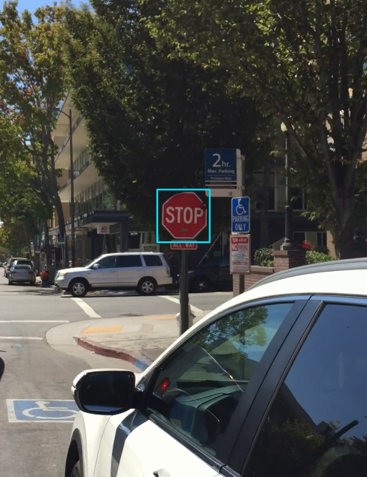
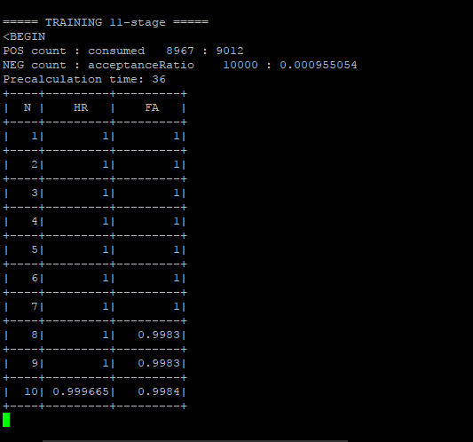

## Stop Sign Detection

In this project I trained a simple Haar cascade classifier to detect and recognize stop signs in an urban area.

## Train the Cascade

I trained a Haar Cascade Classifier using an OpenCV utility. I used 4000 negative images and I produced around 2000 pictures of stop-sign floating in random places. I collected all of them into a single .vec file. The script 'haar_cascade_steps.py' has all the steps to start training.

If all goes well, a cascade.xml file should show up in the output_directory after a couple of hours.

